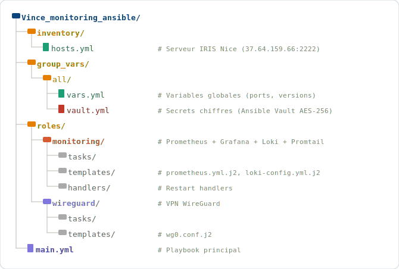

# RP-02 — Automatisation Ansible & Infrastructure as Code

**Réalisation Professionnelle — BTS SIO SISR**
**ANDREO Vincent — IRIS Nice — 2026**

---

## Contexte et objectifs

Dans le cadre du BTS SIO option SISR, cette réalisation professionnelle porte sur l'**automatisation de l'infrastructure du lycée IRIS Nice** via **Ansible** (Infrastructure as Code).

L'objectif était de déployer une stack de monitoring complète (Prometheus + Grafana + Loki + Traefik HTTPS), d'automatiser la gestion des comptes utilisateurs Active Directory pour la rentrée scolaire, d'intégrer l'authentification LDAP dans Grafana, et de sécuriser les secrets d'infrastructure avec Ansible Vault.

---

## Serveur cible

| Paramètre | Valeur |
|-----------|--------|
| Adresse IP | `37.64.159.66` |
| Port SSH | `2222` |
| Utilisateur | `vincent` |
| OS | Debian 12 (Bookworm) |
| Authentification | Clé SSH `~/.ssh/iris` |

---

## Architecture déployée


---

## Stack technique

### Monitoring (rôle `monitoring`)

| Service | Port | Rôle |
|---------|------|------|
| **Traefik v3** | 443/80 | Reverse proxy HTTPS (wildcard *.iris.a3n.fr, Let’s Encrypt) |
| **Prometheus** | 9090 | Collecte métriques (scrape toutes les 15s) |
| **Grafana** | 3000 | Dashboards + auth LDAP (dc=mediaschool,dc=local) |
| **Loki** | 3100 | Agrégation centralisée des logs |
| **Promtail** | 9080 | Agent de collecte de logs → Loki |
| **Alertmanager** | 9093 | Gestion alertes (CPU/RAM/disk) |
| **Blackbox Exporter** | 9115 | Sondes HTTP/ICMP (disponibilité services) |
| **Node Exporter** | 9100 | Métriques système (CPU, RAM, disk, réseau) |
| **cAdvisor** | 8080 | Métriques conteneurs Docker |

### VPN (rôle `wireguard`)

| Paramètre | Valeur |
|-----------|--------|
| Protocole | WireGuard (UDP) |
| Interface | `wg0` |
| Plage réseau | 10.0.0.0/24 |
| Port | 51820 |
| Chiffrement | Curve25519 + ChaCha20-Poly1305 |

### HTTPS & Reverse Proxy (rôle `traefik`)

- **Traefik v3** en reverse proxy devant tous les services monitoring
- Certificats Let’s Encrypt wildcard `*.iris.a3n.fr` (DNS Challenge OVH)
- Tous les services accessibles en HTTPS (443) — plus aucun port HTTP:8080 exposé
- Configuration : `traefik.yml` + labels Docker Compose

### Authentification LDAP Grafana

- Connexion Grafana → OpenLDAP `ldaps://iris.lan:636`
- Configuration : `ldap.toml` (bind DN `cn=admin,dc=mediaschool,dc=local`)
- Mapping groupes LDAP → rôles Grafana (Admin/Editor/Viewer)
- Test validé : comptes étudiants iris.lan connectés (vincenta = Admin)

### Sécurité secrets

- **Ansible Vault AES-256** pour tous les mots de passe et clés privées
- Variables chiffrées dans `group_vars/all/vault.yml`
- Commande de chiffrement : `ansible-vault encrypt_string`

---

## Structure du projet Ansible



---

## Playbooks et commandes

```bash
# Déploiement complet de l'infrastructure
ansible-playbook -i inventory/hosts.yml main.yml --ask-vault-pass

# Déploiement uniquement du monitoring
ansible-playbook -i inventory/hosts.yml main.yml --tags monitoring --ask-vault-pass

# Déploiement uniquement WireGuard
ansible-playbook -i inventory/hosts.yml main.yml --tags wireguard --ask-vault-pass

# Test de connectivité (dry-run)
ansible all -i inventory/hosts.yml -m ping

# Vérifier la syntaxe sans exécuter
ansible-playbook main.yml --syntax-check

# Chiffrer une variable sensible
ansible-vault encrypt_string 'valeur_secrete' --name 'ma_variable'
```

---

## Gestion des comptes Active Directory (Rentrée scolaire)

Automatisation de la création de comptes étudiants en masse :

```yaml
# Exemple de tâche Ansible pour Active Directory
- name: Créer les comptes étudiants depuis CSV
  community.windows.win_domain_user:
    name: "{{ item.login }}"
    firstname: "{{ item.prenom }}"
    surname: "{{ item.nom }}"
    password: "{{ item.password | vault }}"
    groups:
      - "Etudiants-{{ item.classe }}"
    state: present
  loop: "{{ etudiants }}"
```

- Import depuis fichier CSV (liste des élèves IRIS)
- Création automatique des groupes par classe
- Génération de mots de passe conformes à la politique AD
- Notification par email des identifiants aux élèves

---

## Dashboards Grafana

| Dashboard | Description |
|-----------|-------------|
| **System Overview** | CPU, RAM, swap, load average en temps réel |
| **Disk & Network** | I/O disque, bande passante, latence réseau |
| **Docker Containers** | CPU/RAM par conteneur, états, redémarrages |
| **Logs Explorer** | Recherche full-text dans Loki (journald + nginx + auth) |
| **WireGuard VPN** | Connexions actives, transferts de données |

---

## Sécurité et conformité

- **Ansible Vault AES-256** : tous les secrets chiffrés au repos
- **SSH hardening** : clés uniquement, port non standard (2222), no root login
- **Idempotence** : chaque playbook est rejoué sans effet de bord
- **Contrôle des changements** : `--check` mode avant tout déploiement prod
- **Tags** : déploiement granulaire par composant (`--tags monitoring/wireguard`)

---

## Résultats obtenus

| Objectif | Résultat |
|----------|----------|
| Déploiement monitoring complet | ✅ Stack opérationnelle en < 10 min |
| Zéro secret en clair dans Git | ✅ Ansible Vault AES-256 |
| Comptes AD rentrée scolaire | ✅ Automatisés depuis CSV |
| Idempotence des playbooks | ✅ 0 effet de bord sur rejeu |
| Alerting Prometheus actif | ✅ Alertes CPU/RAM/disk configurées |

---

## Compétences validées (Bloc B2 + B3 — E5 SISR)

- **B2.1** — Concevoir une solution d'infrastructure (architecture IaC, Traefik, LDAP Grafana)
- **B2.2** — Installer, tester et déployer (Ansible, Docker Compose, 10/10 tests PASS)
- **B2.3** — Exploiter, dépanner et superviser (monitoring Prometheus/Grafana/Loki, alertes)
- **B3.1** — Protéger les données (Ansible Vault AES-256, secrets hors Git)
- **B3.2** — Préserver l'identité numérique (LDAP Grafana, gestion comptes AD rentrée)

---

## Environnement technique

- **Controller** : Ansible 2.16+ sur poste Linux/Windows (WSL2)
- **Cible** : Debian 12 (Bookworm), serveur IRIS Nice
- **Orchestration** : Docker Compose pour la stack monitoring
- **VCS** : GitHub (`etykx/RP-02-Automatisation-Ansible`)
- **École** : IRIS Nice — Promotion BTS SIO SISR 2025-2026

---

## Fichiers du dépôt

| Fichier | Description |
|---------|-------------|
| `RP-02-ANDREO-Vincent.docx` | Rapport technique complet |

---

*Réalisation professionnelle — Épreuve E5 BTS SIO SISR.*
